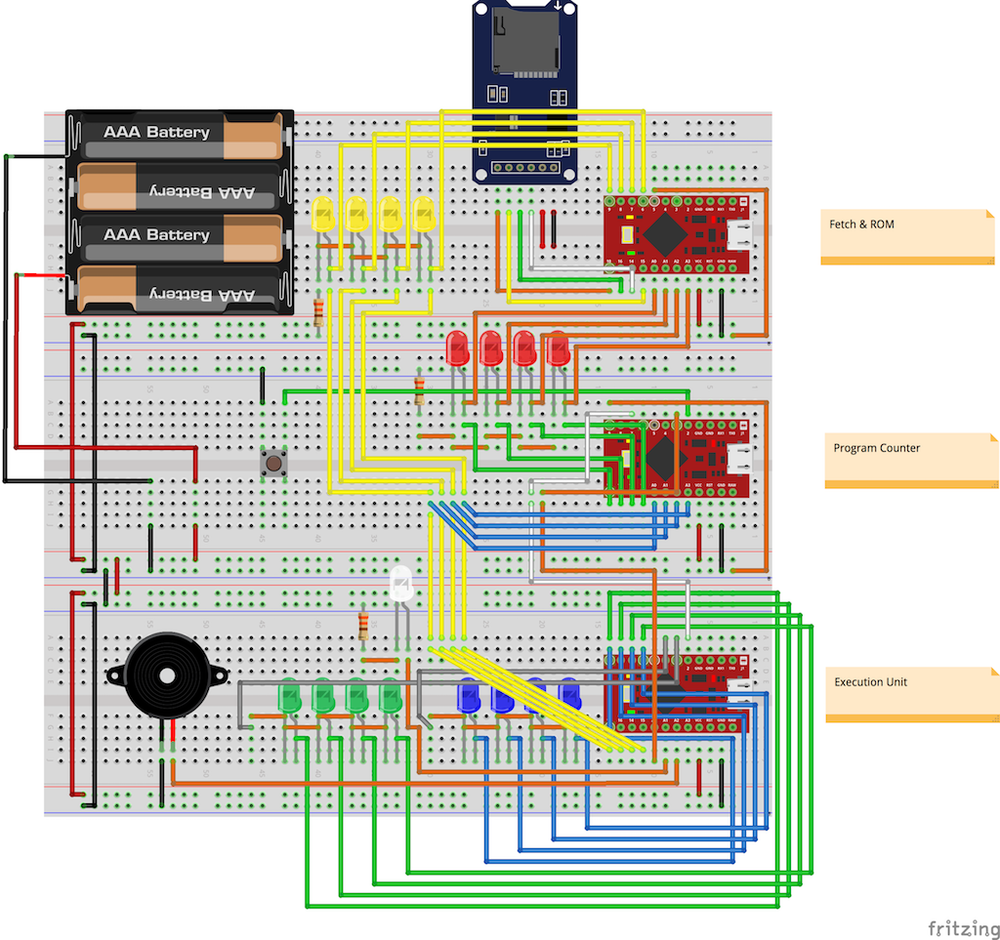
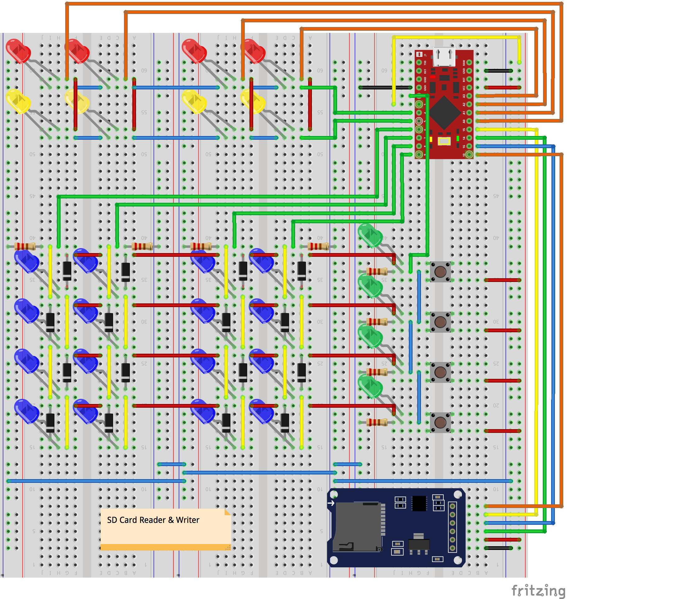

# Arduino CPU

Arduino pro micro を３つ使った 4ビット CPU もどきです。





## プログラムの説明

### プログラムカウンター

ボタンを押すとカウントアップします。16になったらカウントアップが終了します。

9番ピンをLOWにすると低速モードで、HIGHにすると高速モードで動作します。

### フェッチ
  
microSDカードからマシンコードを読み込んでデータバスに流します。
マシンコードは0と1で書かれたテキストファイルです。program0.txt または program1.txt で microSD カードに保存します。

5番ピンをLOWにすると program0.txt を、HIGHにすると program1.txt を読み込みます。

### 実行ユニット
  
ADD命令、JMP命令、MOV命令などを実行します。

### SDカード リーダー & ライター

LEDの向きを変更してプログラムを作れます。
作ったプログラムは、SDカードに program0.txtとして保存されます。

- 赤LED：アドレスに保存されているデータ
- 黄LED：アドレス
- 青LED：プログラムコード、登録できるコードは4つまで。LEDの向きで0と1を区別します。点灯が1、消灯が0です。

タクトスイッチを押すと、アドレスで指定したメモリにデータを保存します。タクトスイッチを押すたびにデータがSDカードに保存され、アドレスが＋１されます。

3番ピンをLOWにするとリーダーモードになります。

## 命令セット

| マシンコード | ニーモニック |      |
| ---- | ---- | ---- |
| 0000 | NOP | 何もしない |
| 0001<br>XXXX | JMP XXXX | XXXXへジャンプ |
| 0010<br>XXXX | JNC XXXX | キャリーフラッグが立っていなければXXXXへジャンプ |
| 0011 | RND B | Bレジスタに0〜15のランダムな値を入れる |
| 0100 | MOV A,0 | Aレジスタに0を入れる |
| 0101 | MOV B,0 | Bレジスタに0を入れる |
| 0110 | MOV A,B | AレジスタにBレジスタの値を入れる |
| 0111 | MOV B,A | BレジスタにAレジスタの値を入れる |
| 1000 | ADD A,1 | Aレジスタに1を加える |
| 1001 | ADD A,2 | Aレジスタに2を加える |
| 1010 | ADD A,A | Aレジスタを2倍にする |
| 1011 | ADD A,B | AレジスタにBレジスタの値を加える |
| 1100<br>1111 | HALT | 終了する<br>※JMP命令と同じ。 |
| 1101 | ---- | |
| 1110 | LD A,XXXX | Aレジスタに RAM[XXXX] の値を入れる |
| 1111 | ST A,XXXX | Aジレスタの値を RAM[XXXX] に入れる |

## サンプルコード

### A=1+2

```
0100
1000
1001
1100
1111
```

### ルーレット

```
0100
1000
0010
0001
0011
0011
0011
0011
0011
0011
0011
0011
0011
0011
1011
0101
```
